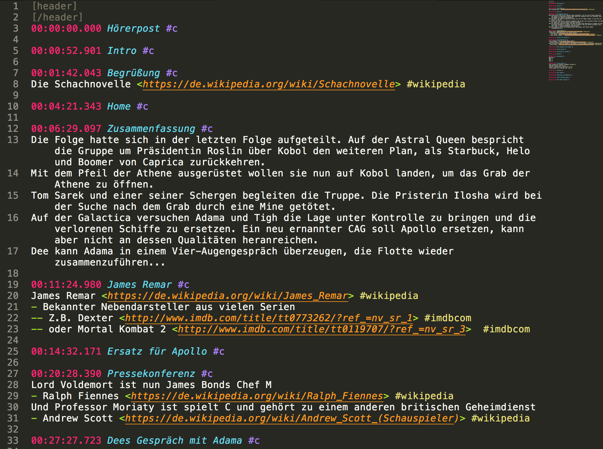

# Sublime Open Shownotes Syntax
Simple Sublime Syntax Highlighting für [Open Shownotes Format][1] (osf).

A very simple Syntax Highlighting for Sublime and the Open Shownotes Format (osf).
The syntax highlighting may not cover the complete OSF specification.
It was done to fit my needs.

This files does not specify any colors. It uses keywords for colors defined in Sublime Themes. For that reason it should work with every *Sublime Text Theme*.

## Install
In *Sublime Text* go to *Preferences* -> *Browse Packages...* and select the *User* Package/Folder.
Download the file [2] into the *User* Folder. 

## Use
Sublime will automatically use the syntax for files ending with *osf* or you manually can select syntax highlighting for files with other extensions via the menu *View* -> *Syntax* -> *Open Shownotes (osf)*.

## Develop & Test
You can change and run tests of the syntax file right from within *Sublime Text*. For that purpose you can use the test file [3].
For more information about building Sublime Text Syntax files and Test files see [Sublime Text Syntax Format Reference][4].
As example about Sublime Themes, see [Monokai.tmTheme][5].

[1]: https://github.com/shownotes/OpenShownotesFormat
[2]: Open Shownotes (osf).sublime-syntax
[3]: Open Shownotes (osf).sublime-syntax-test.osf
[4]: http://www.sublimetext.com/docs/3/syntax.html
[5]: https://github.com/cj/sublime/blob/master/Color%20Scheme%20-%20Default/Monokai.tmTheme
